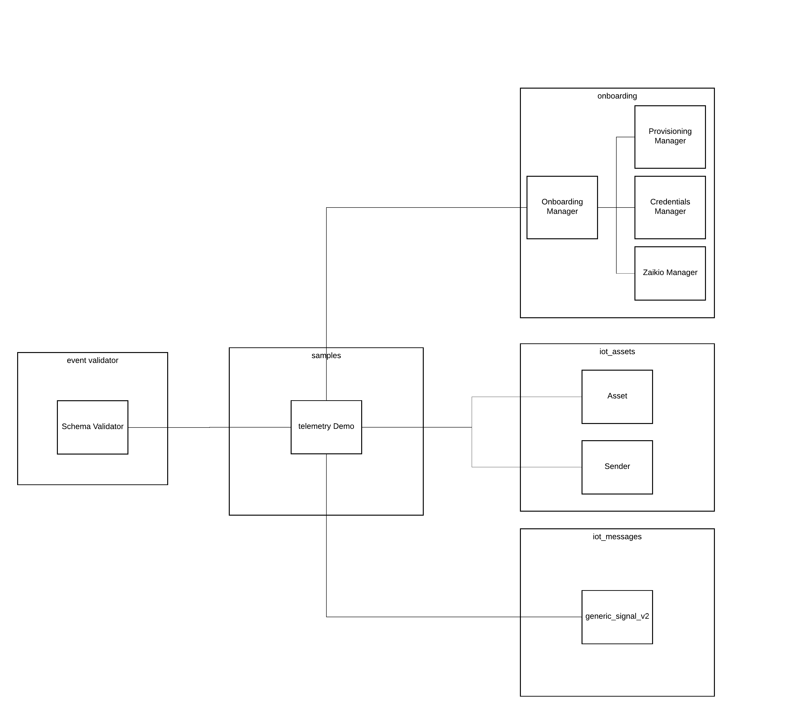

# IoT Client Samples

This folder contains reference clients for the IoT Platform

This is a python iot client based on the paho library. It's using
certificates for client authentication and implements publishing telemetry data
and syncing of the shadow state


## Paho Python IoT Client

This is a python client for the IoT platform. It uses the paho library for
the mqtt communication. Certificates are used for authentication of the client.

It demonstrates sending of telemetry messages via the aws IoT
[basic ingest](https://docs.aws.amazon.com/en_pv/iot/latest/developerguide/iot-basic-ingest.html)
and sync the
[shadow state](https://docs.aws.amazon.com/en_pv/iot/latest/developerguide/iot-device-shadows.html)
via [mqtt api calls](https://docs.aws.amazon.com/en_pv/iot/latest/developerguide/device-shadow-mqtt.html):


### Setup

The reference client is based on python 3.7 and [pipenv](https://pipenv-fork.readthedocs.io/en/latest/)
as a virtual environment and dependency management tool.

**{PROJECT_ROOT}** is the place holder for the path where you stored / cloned the reference-client project
        
    pip install pipenv
    cd {PROJECT_ROOT} 
    pipenv install

### Run the demo   
    
Make sure to set environment variables before you start the demo.
You will have a env.* file for each environment (dev, stg and prd)
We will use our virtual environment (pipenv) to set the environment variables.


Mac / Linux user: 

    cd {PROJECT_ROOT} 
    export PIPENV_DOTENV_LOCATION=./env.{prefered_environment*}  
    
Windows user: 

    cd {PROJECT_ROOT} 
    set PIPENV_DOTENV_LOCATION=.\env.{prefered_environment*}  


Then start the virtual environment with

    pipenv shell
    
        
*We recommend you to run the reference client against our stage (env.stg) environment 
since the development environment is under heavy development

#### Verify the changes
Open the debug monitoring tool: \
    [Development](http://monitor.iot.dev.heidelberg.cloud.s3-website-eu-west-1.amazonaws.com) \
    [Stage](http://monitor.iot.stage.heidelberg.cloud.s3-website-eu-west-1.amazonaws.com) \
    [Production](https://monitor.iot.connectprint.cloud) 

#### Telemetry demo

Send telemetry messages and sync the state by running:

    python ./src/run_telemetry_demo.py

The monitoring tool will only show messages that have:

    eventType='reference-client-test'

#### Further explanations

##### Authentication

The connection is authenticated by certificates. The client verifies the
server by it's server certificate and the server authenticates the client by
it's individual signed client certificate.

If you run the demo for the first time the certificates will be downloaded and stored for you.
Folder ```certificate_store``` in ```{PROJECT_ROOT}```. The next run the certs will be reused.
Please be aware that for every provisioning call new assets will be created in the backend.

The IoT Core certificate is signed by an Amazon Root Certificate and has to be
present as "AmazonRootCA1.pem" and the client certificates have to exist as
signed certificate and private key and have to have the same name as the thing
or client.

The ```certificate_store``` folder should have these files:

- amazonRootCA1.pem -> Sever certificate
- clientID.txt -> text file with the client/thing ID
- deviceCert.cert -> Device certificate
- devicePrivateKey.pem -> Private Key of the device (Store this securely!)
- devicePublicKey.pem -> Public Key of the device 

One thing / device can only have one connection to the IoT Core at the same time.


### Unit Tests

The unit tests are integrated into the top level testing package:

    cd {PROJECT_ROOT}
    pipenv run python -m unittest discover src
    
or    
    
    cd {PROJECT_ROOT}
    pipenv shell
    python -m unittest discover src


### Architecture



The reference client shows the usage of telemetry messages and shadow updates.
It consists for three classes:

- Device: The device class has a state that, is synced by the
ShadowHandler. The Device and the ShadowHandler use the IoTClient
to connect to the MQTT Endpoint.
- IotClient: The IoTClient takes care of the network connection. The connection
is used to publish telemetry messages and exchange messages with the Shadow
Service to sync the device state.
- ShadowHandler: This class takes care of syncing the device state with
the AWS Shadow Service. It uses the existing IoTClient to exchange MQTT
messages with the shadow service topics.


#### Telemetry

##### Reference client implementation of telementry messaging

The reference client has a sample function Device#start_publishing for sending
a couple of telemetry messages via the Device#publish_telementry function.

##### Topic

The topic used for telemetry messages is
"$aws/rules/iot_data_platform_telemetry_{env}"

It's a basic ingest topic that only triggers the aws iot rule
("iot_data_platform_telemetry_{env}"). Clients cannot subscribe to this topic.

##### Message

The payload of the messages is a json string. The json object has all header
attributes on the top level and the payload as a nested json object as "payload"
toplevel attribute. See the HDM Jira page for event header specification.

Sample json object:

    {
    "payloadVersion": "1",
    "assetType": "ID_Cutter",
    "senderEventUuid": "ed7335bc-9cf8-49b0-8673-60497f1e54a6",
    "senderType": "prinect",
    "eventType": "ODA",
    "eventSubtype": "InkConsumptionSummary",
    "assetTimestamp": "2019-09-10T17:08:39+02:00",
    "assetId": "AUTOTEST_CUT",
    "senderId": "PTS-000047-130129-0751",
    "senderTimestamp": "2019-09-10T17:08:39.557+02:00",
    "connectionDeviceId": "LiveTestSimulator01",
        "payload": {
            "productiondataacquisition": {
                "message": [{
                    "inkconsumptionsummary": [{
                        "jobid": "Integrationstest_1-1000_Auflage1_p0012",
                        "inkconsumptions": [{
                            "inkconsumption": [{
                                "colorname": "SaphiraDigitalInkYellowPrimefire",
                                "amount": "670.0184345245361"
                            }],
                            "inkuse": "GoodProduction"
                        }],
                        "workstepid": "r_190726_062245389_035886",
                        "id": "0"
                    }],
                    "deviceid": "6000"
                }]
            }
        }
    }

#### Shadow Service

Info: Currently the shadow functionality is not supported by the iot platform.

##### Reference Client implementation of shadow state sync

The ShadowHandler implements updating the device state via the AWS
Shadow Service. The ShadowHandler updates the device state as soon as the
IoTClient connects the device successfully. It takes care of listening for
updates (desired states) and publishing of state changes (reported states).

##### Topics

The Shadow Service uses a couple of MQTT topics to report the device state and
request desired state changes. See the
[AWS documentation](https://docs.aws.amazon.com/en_pv/iot/latest/developerguide/device-shadow-mqtt.html)
for details.

##### Messages

State updates are communcated as json strings.

The devices receives state updates as desired states:

    {
        "state": {
            "desired": {
                "event_publishing_enabled": true,
                "event_type_blacklist": []
            }
        }
    }

The devices sens state updates as reported states:

    {
        "state": {
            "reported": {
                "event_publishing_enabled": true,
                "event_type_blacklist": []
            }
        }
    }


## Licenses
Show [Licenses](licenses.txt) or generate them with the command ``pip-licenses`` in the pipenv environment

##Changelog
#####15/01/2020
Initial repository setup:
- Refactor legacy reference-client
- use pipenv as management and dependency tool
- Enhance legacy reference client with provisioning use case
#####20/01/2020
enable api version 2
- Refactor reference client to api version 2
- change provisioning of environment variables (os independent)